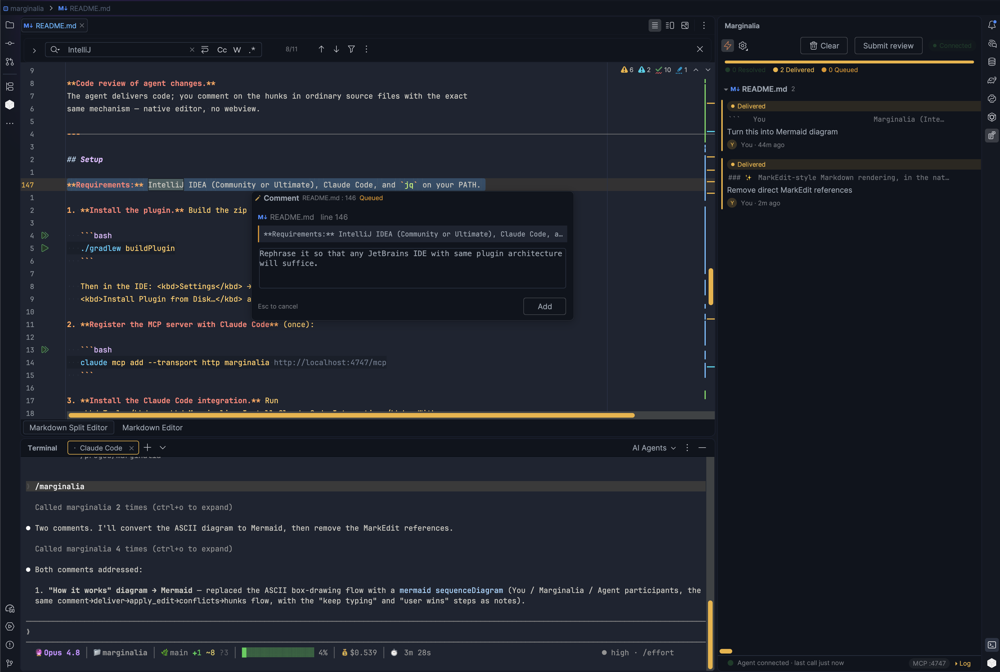
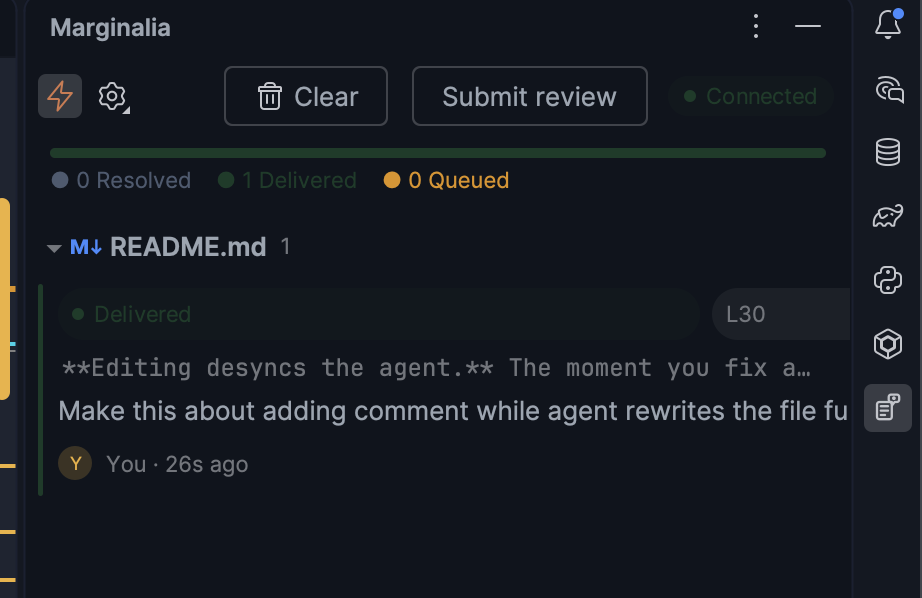
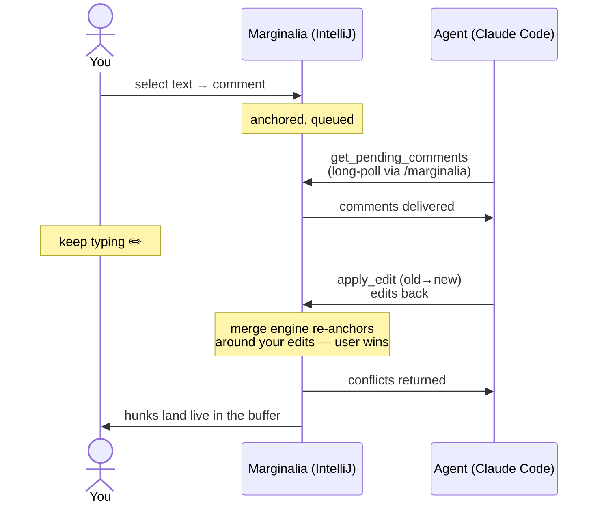

# Marginalia

> **Review your AI agent's work the way you review a pull request — inline, anchored to the text, without ever leaving the editor or breaking the agent's flow.**


[](https://plugins.jetbrains.com/plugin/32287)

**✨ Get Marginalia from the [JetBrains Marketplace](https://plugins.jetbrains.com/plugin/32287) — one click, no manual build.**

Marginalia turns IntelliJ into a **live co-editing surface** between you and an AI coding
agent. You comment on ranges of a document like a PR reviewer; the agent receives those
comments through a local MCP server and merges its edits back into the *same buffer you are
typing in* — repositioned around your concurrent changes, never clobbering them.

It is a **sidecar to the agent, not a wrapper around it.** You keep running Claude Code (or
any MCP-speaking agent) exactly as you do today — its native TUI, skills, slash commands,
plan mode, all intact. Marginalia adds the one thing a chat box can't: a shared canvas.




---

## Quick Start

Four steps and you're co-editing:

1. **Install the plugin** from the [JetBrains Marketplace](https://plugins.jetbrains.com/plugin/32287) (<kbd>Settings</kbd> → <kbd>Plugins</kbd> → <kbd>Marketplace</kbd> → search *Marginalia* → <kbd>Install</kbd>).
2. **Register the MCP server** with Claude Code (once):
   ```bash
   claude mcp add --transport http marginalia http://localhost:4747/mcp
   ```
3. **Install the Claude Code integration** — <kbd>Tools</kbd> → <kbd>Marginalia: Install Claude Code Integration</kbd> (installs the edit-routing hook and the `/marginalia` command).
4. **Open a file, add a comment, and run `/marginalia`** in the agent — it long-polls for your comments and addresses them as they arrive.

See [Setup](#setup) for the full details and the build-from-source path.

---

## Why Marginalia

Iterating on a PRD, an architecture doc, or freshly generated code with an agent usually
means describing changes in chat. That breaks down fast:

- **Pinpointing is exhausting.** "Rewrite the third paragraph under *Deployment*" is a
  terrible addressing scheme. Selecting the text and commenting on it is the right one.
- **Full rewrites clobber everyone.** Comment while the agent regenerates the whole file
  (the Cowork Canvas pattern) and the writes collide — your edit, the agent's version, or
  your comment gets destroyed.
- **Turn-taking kills flow.** While the agent works one comment, you're frozen: don't type,
  don't comment, or you lose changes.

Marginalia fixes all three. Comment as you read. Keep typing while the agent works. Edits
from both sides land in one buffer that never reloads.


|                        | Chat-only iteration              | Marginalia                            |
| ---------------------- | -------------------------------- | ------------------------------------- |
| Targeting a change     | Describe it in prose             | Select the text, comment on it        |
| Editing it yourself    | Desyncs the agent                | Agent reads the live buffer next turn |
| Agent applies a change | File reloads, your edits at risk | Merged in place,**you win conflicts** |
| Working in parallel    | Blocked until the turn ends      | Keep typing and commenting freely     |
| The agent's UX         | —                               | Untouched: native Claude Code TUI     |

---

## Highlights

### 📝 PR-style comments anchored to the text

Select a range, hit <kbd>Ctrl/Cmd+Alt+M</kbd>, type your note. The comment is anchored to
the actual text (not a line number), so it survives edits by either side. A floating
toolbar button appears on selection if you prefer the mouse.

### 🔀 A merge engine that never overwrites you

Every agent edit passes through Marginalia's merge engine. Hunks are re-anchored against
your concurrent typing (exact → whitespace-tolerant → fuzzy match) and applied in place.
If an edit collides with something you changed, **the user wins**: the conflict goes back to
the agent with the current text and surfaces in the tool window for manual apply.

### 🗂️ A review sidecar, not a chat

The tool window groups pending comments by file, shows dispatch state, a resolved /
delivered / queued progress ribbon, applied-hunk history, and any conflicts that need you.
The agent's own TUI is the chat — this panel is the review queue.



### ✨ Rich Markdown rendering, in the native editor

For `.md` files, Marginalia layers visual richness directly onto the IntelliJ editor — no
webview, no second pane. The raw source stays byte-identical for you *and* the agent;
every enhancement is ephemeral decoration.

### 🤝 Agent-agnostic by construction

Anything that speaks MCP gets the same powers with a single config line. Built and tested
against Claude Code; Codex CLI, OpenCode, and friends work the same way.

---

## How it works



1. You comment on a text range. The file becomes **co-edited** and the comment is queued.
2. The agent pulls comments via the `get_pending_comments` MCP tool. The recommended way to
   run it is a single **`/marginalia`** — it long-polls the queue (holding the call open until
   you comment), addresses what arrives, and stops on its own after ~90 minutes idle so a
   forgotten session can't run up cost. See [Continuous monitoring](#continuous-monitoring).
3. A **PreToolUse hook** denies the agent's native `Edit`/`Write` on co-edited files and
   redirects it to `mcp__marginalia__apply_edit`, which merges hunks into the live buffer.
   Conflicts with your edits are returned to the agent. **User wins.**
4. The tool window tracks the queue, dispatch state, applied hunks, and conflicts.

---

## Continuous monitoring

You want the agent to pick up comments as you write, without babysitting it. Pick one:

- **Recommended — plain `/marginalia`.** It calls `get_pending_comments` with a 30-minute
  long-poll: the call holds open and returns the instant you queue a comment, so reaction is
  near-immediate while idle polling costs almost nothing. After 3 consecutive empty 30-minute
  holds (~90 minutes with no comments) it **stops by itself** and tells you to re-run
  `/marginalia`. This auto-stop is deliberate: a session you forget about cannot keep burning
  tokens overnight.

- **Alternative — `/loop Use MonitorTool to poll /marginalia command for new comments`.** A
  background monitor tool checks the queue with a smaller per-iteration footprint. Use this if
  you specifically want a `/loop`.

  > ⚠️ **A forgotten `/loop` never stops on its own and keeps accruing cost.** An idle overnight
  > `/loop` session once ran up roughly **$150** doing no useful work. Only use `/loop` if you
  > will remember to end it.

> The old advice to run **`/loop 1m /marginalia`** is discouraged — re-running the command every
> minute spends tokens continuously even when the queue is empty, with no natural stopping point.
> Prefer plain `/marginalia`.

---

## Workflows

**As-I-go review (the primary flow).**
Start the agent with `/marginalia` so it long-polls the queue on its own. Read the
doc the agent drafted. Select a sentence → <kbd>Ctrl/Cmd+Alt+M</kbd> → "too vague, give
concrete failure modes" → keep reading. With auto-dispatch on, comments reach the agent within
the next poll, and its edits arrive inline. You never stop to wait, and you never have to tell
it to check.

**Batch review ("submit review").**
Toggle auto-dispatch off, accumulate comments across several sections, then flush them as a
single prompt — classic PR style, good for coherent multi-section rework.

**Direct edit + comment.**
Rewrite a paragraph by hand, comment elsewhere. The agent reads the live buffer (`read_doc`)
on its next turn, so your manual edits are automatically in its context. There is no sync
step to remember.

**Code review of agent changes.**
The agent delivers code; you comment on the hunks in ordinary source files with the exact
same mechanism — native editor, no webview.

---

## Setup

**Requirements:** Any IntelliJ-based JetBrains IDE (IntelliJ IDEA, PyCharm, WebStorm, GoLand, Rider, …, Community or commercial), Claude Code, and `jq` on your PATH.

1. **Install the plugin.** The easiest way is from the
   [JetBrains Marketplace](https://plugins.jetbrains.com/plugin/32287): in the IDE go to
   <kbd>Settings</kbd> → <kbd>Plugins</kbd> → <kbd>Marketplace</kbd>, search for
   *Marginalia*, and click <kbd>Install</kbd>.

   Prefer to build it yourself? Produce the zip and install it from disk:

   ```bash
   ./gradlew buildPlugin
   ```

   Then in the IDE: <kbd>Settings</kbd> → <kbd>Plugins</kbd> → <kbd>⚙️</kbd> →
   <kbd>Install Plugin from Disk…</kbd> and pick the zip from `build/distributions/`.
2. **Register the MCP server with Claude Code** (once):

   ```bash
   claude mcp add --transport http marginalia http://localhost:4747/mcp
   ```
3. **Install the Claude Code integration.** Run
   <kbd>Tools</kbd> → <kbd>Marginalia: Install Claude Code Integration</kbd>. With your
   confirmation it installs:

   - `~/.marginalia/marginalia-hook.sh` — the PreToolUse edit-routing hook
   - a `PreToolUse` hook entry in `~/.claude/settings.json`
   - `~/.claude/commands/marginalia.md` — the `/marginalia` slash command

That's it. Open a file, add a comment, and start the agent with **`/marginalia`** — it
long-polls for your comments and addresses them as they arrive, then stops on its own after
~90 minutes idle. See [Continuous monitoring](#continuous-monitoring) for the trade-offs and a
lower-footprint `/loop` alternative.

---

## Markdown rendering in detail

All Markdown enhancements are decorations over the bundled `org.intellij.plugins.markdown`
PSI. The buffer is never rewritten; rendering is purely visual and toggles per feature in
**Settings → Tools → Marginalia**.

**Tier 1 (on by default)**

- Styled headings (a distinct color per H1–H6), bold/italic emphasis, strikethrough, and
  colored list markers — all recolorable in **Settings → Editor → Color Scheme → Marginalia**.
- Blockquote left-bar accent and full-width horizontal-rule painting.
- Folded link `](url)` targets, YAML frontmatter, and HTML comments (caret or <kbd>Ctrl+.</kbd> expands).
- Gutter icons for images (preview popup) and Mermaid diagrams (rendered on demand in a JCEF
  popup via bundled `mermaid.min.js`).

**Tier 2 (on by default for titles and tables; opt-in for inline images)**

- Large H1/H2 custom-fold glyph for a reading-flow view.
- Aligned table grid rendered in the fold region.
- Opt-in inline image fold (off by default).

**Heading outline / navigation** comes from the IDE's built-in Structure view
(<kbd>View → Tool Windows → Structure</kbd>, or <kbd>Cmd+7</kbd> / <kbd>Ctrl+F12</kbd>) —
the bundled Markdown plugin renders the heading tree with no extra code.

---

## MCP tools

The agent-facing API. Full contracts in [docs/main-prd.md §6](docs/main-prd.md).


| Tool                   | Purpose                                                    |
| ---------------------- | ---------------------------------------------------------- |
| `list_co_edited_docs`  | Which files are currently live co-edited                   |
| `read_doc`             | Read the live buffer (never disk); records the merge base  |
| `apply_edit`           | Apply`old_text → new_text` hunks through the merge engine |
| `get_pending_comments` | Pull queued comments (marks them dispatched)               |
| `resolve_comment`      | Mark a comment addressed, with an optional note            |

---

## Development

- `./gradlew test` — unit + light platform tests
- `./gradlew verifyPlugin` — plugin structure / API compatibility checks
- `./gradlew runIde` — sandbox IDE for manual testing
- `./gradlew buildPlugin` — installable zip in `build/distributions/`

See [CLAUDE.md](CLAUDE.md) for the architecture map and IntelliJ Platform rules, and
[docs/main-prd.md](docs/main-prd.md) for the full product requirements and roadmap.

---

Plugin based on the [IntelliJ Platform Plugin Template][template].

[template]: https://github.com/JetBrains/intellij-platform-plugin-template
